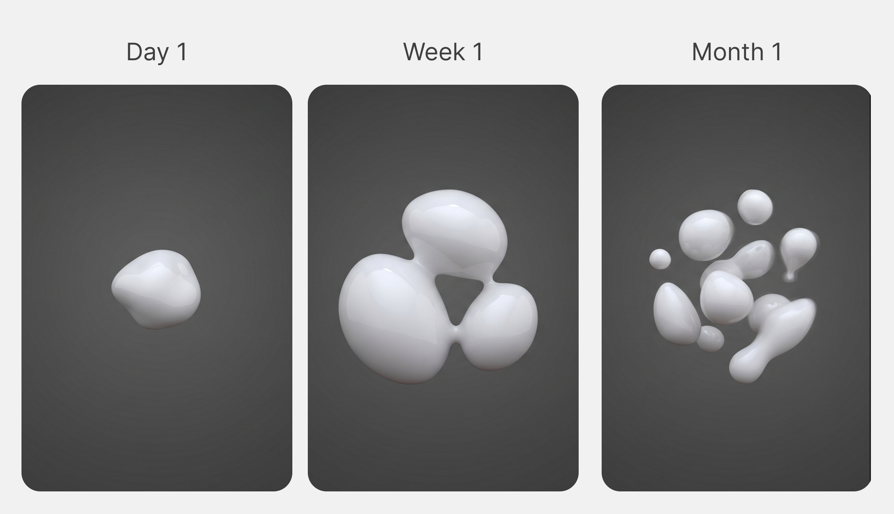

I think software should adapt to us.
So far we've done the opposite.
We configure. We set it up.
And we call that personalization. It isn't.

For software to adapt, it has to learn us over time, from our digital footprint. Every email, every transaction, every chat with an agent. That footprint is non-deterministic. We're living organisms; the data we produce is alive in the same way. A fixed structure can't learn from something alive. To learn what's moving, the learner itself has to move.

In today's stack, the closest thing to this kind of learner is the memory layer. But memory, as it's typically built today, is a fixed structure trying to hold non-deterministic data. It doesn't learn. It memorizes.

This post is about what we built in response. We call it Adapt.

---

## Two Things Memorization Cannot Do

Memorizing fails in two concrete ways. Both show up everywhere.

**1. It can't answer questions that only exist across time.**

Consider a therapist preparing for a session. Their client mentioned their father in session 2, frustrated and dismissive. In session 7, the father came up again, but the framing had shifted. Less anger. Something closer to grief. The therapist didn't catch it in the moment. Nobody did.

If you were the engineer asked to build them a tool for this, your first instinct would probably be retrieval. Index every transcript, embed every sentence, surface the relevant passages on demand. Every mention of "father" is one query away. But the therapist actually needs an answer to something else: *how has this client's relationship to their father changed?* That isn't in any single session. It exists in the diff between session 2 and session 7. To see it, something had to be paying attention as the sessions went by, noticing the shift in tone, watching what recurred and what faded.

*There are questions you can only answer if you were paying attention along the way.*

This generalizes. *Why does this user keep starting projects they never finish?* *What's actually slowing down our deal cycle?* No retrieval system holds these answers, because the answers were never written down. A memorized archive, no matter how well-indexed, can give you the right document. It can't tell you what's evolving inside it.

**2. It can't remember what it wasn't told to remember.**

When data shows up that doesn't fit the predefined categories, fixed memory has two options: force it into the wrong slot, or throw it away. Either way, the data is gone, and the memory has no feedback loop telling it what it's missing. It can't grow into the shape its data actually wants. It can only stay the shape it was given.

Both failures are the same failure underneath. The memory was finished too early.

At Unbody, almost every project we build runs into this.

---

## What Adaptive Memory Actually Looks Like

Adapt is built around two units. A **Brain** is the orchestrator. **Neurons** are the units of learning, each focused on a specific domain. The Brain decides how the neurons are organized, routes data to them, and synthesizes their knowledge when you ask a question.

The system adapts at two levels, mapping directly to the two failures above.

### Neurons adapt to what they see

Each neuron runs an observe-then-understand cycle. It reads incoming data against its own purpose, decides what's relevant, and dismisses the rest — but tracks what it dismissed. When enough observations accumulate, it synthesizes. Not appends. *Synthesizes.* It asks: does this confirm or contradict what I already know? Is this pattern recurring or fading? Is something that used to matter dropping out?

The output is compressed knowledge that evolves with each cycle. The understanding persists. The raw data does not.

To make that concrete, here's roughly what a neuron's understanding looks like after processing a few hundred observations of a developer's commits, reviews, and discussions:

> Strong preference for composition over inheritance, confirmed in 7 of the last 12 architectural reviews. Intensified after the March refactor of the auth module; since then, has rejected three PRs that introduced base classes. Recurring frustration with "cleverness" in code: flagged in 4 commit messages and 2 code reviews. Notable tension: claims to value simplicity but consistently introduces type-level abstractions in new modules. The two coexist: runtime simplicity, type-layer complexity.

That's not a log. It's not an embedding. It's a model of someone, built by paying attention. And it can answer questions no document contains, the kind from failure (1).

### The Brain adapts its own structure

Every neuron tracks not just what it processed but what it couldn't: dismissed data, unanswered queries, observations that didn't fit. These accumulate as signals, and the Brain watches all of them.

When enough signals build up, the Brain evaluates its own network. *Is this the right shape for what it's encountering?* An overloaded neuron (one tracking too many concerns) gets split into specialized parts. Two neurons doing redundant work get merged. Data that keeps arriving with no neuron to process it triggers a new one. Neurons that haven't been useful in a long time get pruned.

A scenario: a sales team deploys an assistant configured to track deal status, objections, and competitors. Three months in, deals keep dying after the demo but before the contract. The assistant can't explain why. Nobody configured it to track internal approval processes. A traditional memory stops there.

A Brain doesn't. It notices that queries about deal blockers keep failing, that dismissed mentions of "legal review" and "procurement timelines" keep accumulating. It signals the gap, grows a neuron for it, and starts building understanding in a domain it was never told to care about. This is the answer to failure (2).

You don't reconfigure Adapt when your data changes. Adapt reconfigures itself.

---

## Querying

When you ask a question, each neuron answers from what it has learned, not from raw data. The Brain synthesizes across all of them into a single response, with relevance and confidence scores, and explicit awareness of what it doesn't know. The fact that neurons can be added, split, or pruned between queries is invisible at this layer. You ask, you get the current best answer the system can produce.

---

## Using It

Adapt is open source. It's a Node.js library. You bring the LLM. You describe what you want understood. The system handles the rest.

```typescript
import { Brain } from '@unbody/adapt'
import { openai } from '@ai-sdk/openai'

const brain = new Brain({
  prompt: 'Understand this user, their patterns, goals, and how they shift over time.',
  model: openai('gpt-4o'),
})

await brain.inject(events)
const insight = await brain.ask('What has changed in the last month?')
```

It doesn't replace your database or your RAG pipeline. It does what they structurally can't: it adapts. To time. To patterns. To its own gaps. To the data it's actually seeing, not the data you guessed it would see.

---

Memory that doesn't adapt isn't really memory. It's an archive.

*Adapt is open source. [@unbody/adapt on GitHub](https://github.com/unbody-io/adapt)*
