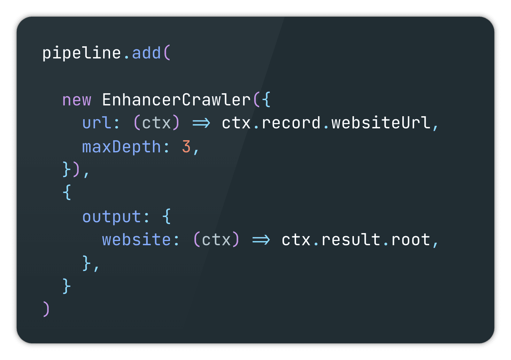
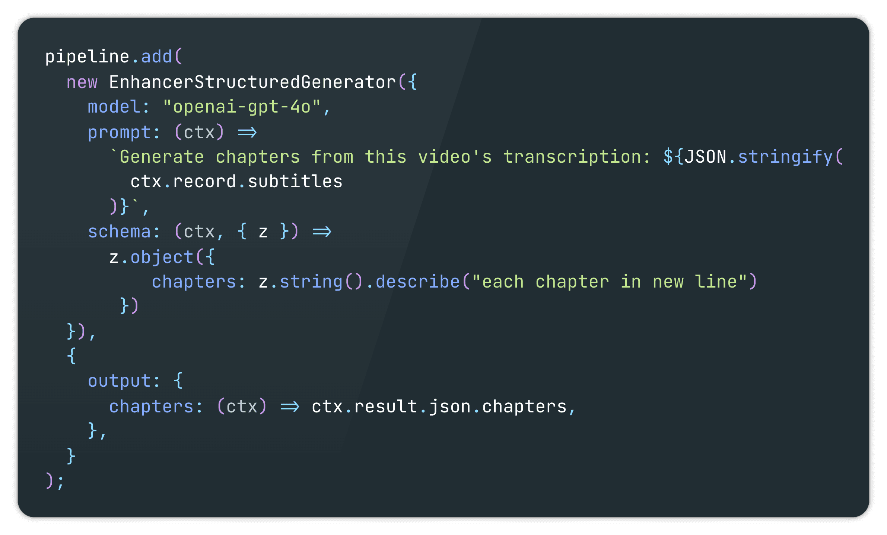
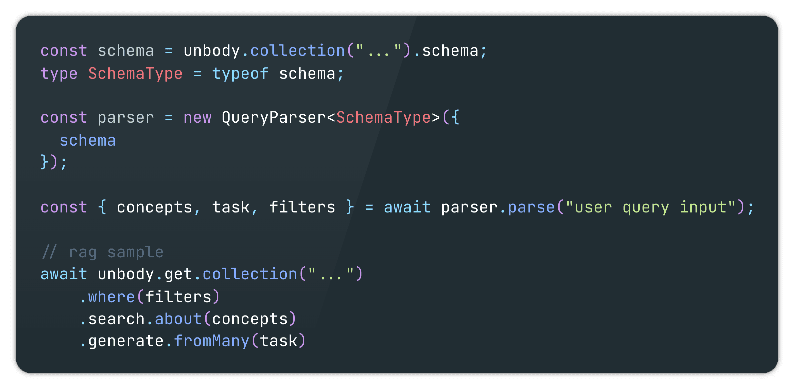
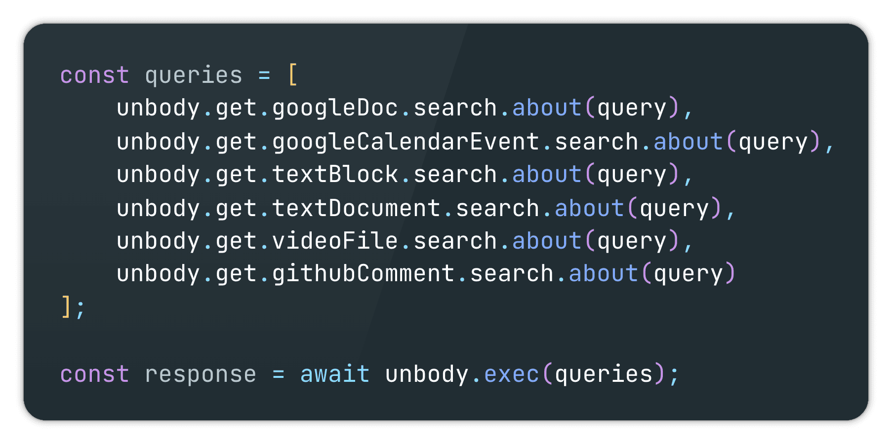
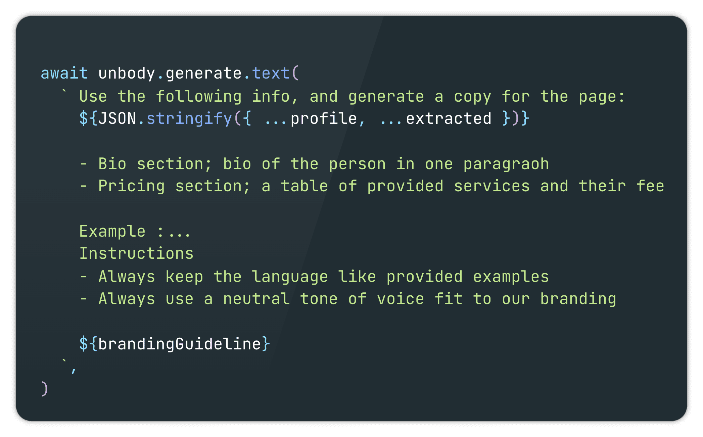

The shift toward AI-native applications marks a fundamental change in how software is designed and used. While many applications today are _AI-enabled_ (AI-enhanced features added to existing products), the next generation of software is becoming _AI-native_, where AI isn’t just a feature—it’s the foundation.

But there’s a development gap here. When you look at current AI tools from a developer’s perspective, they often feel “AI-forced” rather than truly AI-native. For the last few years, the machine learning community has made impressive strides, creating advanced tools at a fast pace. However, this rush has led to some real challenges for developers building actual products.

### The Problem: “AI-forced” Development

The issue lies in how these tools are built—they are neither accessible nor compatible with traditional product development. Instead, they impose a fragmented toolchain that feels clunky and cumbersome, forcing developers into a parallel ecosystem just to integrate AI. Here’s what this looks like in practice:

- **Databases**

  - Dual systems for product data (PostgreSQL/MongoDB) vs. embeddings (Weaviate/Pinecone), leading to data sync headaches and redundant management.

- **APIs and Endpoints**

  - Separate API layers for product and AI functions mean double the endpoints to create, maintain, and secure.

- **Data Processing Pipelines**

  - Different ETL pipelines for product data vs. AI embeddings or features, adding unnecessary workflow complexity.

- **Caching**

  - Duplicated cache setups for product data and model responses increase infrastructure load and maintenance.

- **Content Delivery Network (CDN)**

  - Distinct CDNs for product assets vs. AI models and datasets, driving up costs and deployment complexity.

- **Logging and Monitoring**

  - Splitting logs between product and AI metrics creates gaps in monitoring and makes it hard to get a complete performance picture.

- **Authentication and Access Control**

  - Different access requirements for product features vs. AI models mean more friction and a heavier security load.

- **Error Handling**

  - Handling model inference errors separately from regular product errors adds an extra layer of exception management.

- **CI/CD and Deployment**

  - Product and model deployments require separate pipelines, complicating releases and increasing coordination work.

- **Experiment Tracking and Version Control**

  - Product changes and AI experiments need separate tracking setups, making rollbacks and updates twice as complicated.

- **Data Backup and Recovery**

  - Dual backup systems for product data and AI embeddings add storage overhead and complicate recovery.

- **Infrastructure Scaling**

  - Separate infrastructure needs (CPU for product, GPU for models) make scaling expensive and add management overhead.

This is the real barrier to building AI-native applications right now: the sheer duplication and disconnect in tooling that developers have to deal with.

### Our Journey with Weaviate

When we first built Unbody, it was designed to be a backend system for modern web applications—something flexible, API-driven, and able to handle the demands of today’s products. In 2022, we came across Weaviate, and it opened up new possibilities. We saw that Weaviate wasn’t just a vector database; it could also perform standard database operations like filtering, sorting, grouping, and schema building—all while supporting AI-native functions.

This discovery led us to rethink our approach. With Weaviate, we realized we could consolidate the AI and product stacks into one. Instead of separate systems, we could have a single, unified stack that’s AI-native at its core. So, we started with Weaviate as our foundation, using it as our primary database while building out a stack around it that could handle both AI and standard data operations seamlessly.

Since then, we’ve continued expanding Unbody on top of this foundation, aiming for a single, cohesive stack that lets developers build AI-native applications without the hassle of managing separate systems.

### Building Unbody: Merging Two Worlds into One Stack

Once we knew Weaviate could give us the backbone we needed, we built Unbody with one clear goal: no more separate stacks for AI and product. Everything—APIs, data processing, logging—should just work together. Weaviate gave us the right database foundation, and from there, we built Unbody as a framework where developers can finally use AI as part of the product stack, not as an add-on.

## AI-native

When we speak about AI-native, as Bob Van Luijt puts it, we're referring to software where the AI model is essential—if you remove it, there’s no app left.

To expand on this, there’s a key concept that helps define the core characteristics of AI-native applications:

> ##### **“Users are no longer seeking information, but answers.”**

This single shift is driving the transition to AI-native design, reshaping how humans interact with software.

Think about it—users no longer want to sift through endless information or dig through forums like Stack Overflow to find solutions. Instead, they want direct answers, efficiently and accurately. This shift is evident in the decline of traditional search engines like Google and even platforms like Stack Overflow. We humans are naturally inclined toward convenience and efficiency. Traditionally, we would gather information, study it, and eventually come to an answer ourselves. But with the rise of AI, especially large language models (LLMs), this process has fundamentally changed.

AI-native software isn’t just an enhancement; it’s a transformation of how users achieve their goals. Now, applications don’t merely provide data—they provide context, understanding, and action-ready responses.

### The 4 Core Components of AI-Native Applications

As we redefine software to meet users' demand for answers over information, certain foundational elements become crucial. Through our journey with Unbody, we identified four core components that are essential for creating true AI-native applications. These components drive the shift from traditional, information-centric software to answer-driven, AI-native experiences. Here’s how Unbody brings these elements together in a cohesive framework.

### 1. **'knowledge-base' instead of 'database'**

Traditional databases store data, but AI-native apps need a **knowledge-base** that provides real answers, not just information. With Unbody, we built a data enhancement pipeline to make raw data more meaningful and context-aware. Here’s what it does out of the box:

- **Image Captioning**: Adds captions to images, making visual content searchable.

- **Text Extraction (OCR)**: Pulls text from images or scans and integrates it into the knowledge-base.

- **Video Transcription**: Transforms audio into searchable text.

- **Summarization and Keyword Extraction**: Summarizes documents and extracts keywords for SEO or content analysis.

- **Website Content Scraping**: Fetches and structures data from URLs, bringing external content directly into the system.

This enhanced knowledge-base allows us to go beyond static data and provide richer, contextual answers.

### 2. **'intent' instead of 'syntax'**

AI-native applications need to work with natural language as a main input. While LLMs are great at understanding language, they don’t directly turn it into structured operations for a database. So, we built Unbody’s **query-parser** endpoint.

This endpoint takes in unstructured language and outputs structured JSON based on a schema we define. It’s designed to handle inputs for both retrieval and generation stages, as well as any filtering we need. Here’s how it works:

- **Input**: Unstructured user query.

- **Output**: Structured JSON ready for whatever the next action is, whether it’s database retrieval or further processing.

This query-parser bridges that gap between language input and backend operations, saving developers time and effort.

### 3. **'context' instead of 'content'**

To build an app that truly understands users, you need to handle data from multiple sources and in various formats. Today’s data is spread across platforms like Google Drive, Discord, and internal databases, and it comes in different forms—text, image, video.

Unbody is designed to be **data-source and data-type agnostic**. Here’s how we make that work:

- **Plugin-Based Data Integration**: Connects seamlessly to cloud storage, messaging platforms, and other sources.

- **PUSH API**: Allows any data schema to be pushed directly, no strict structure required.

- **Unified Schema via Weaviate**: Weaviate’s flexibility with multimodal data allows us to bring everything—text, images, embeddings—into one cohesive schema. It’s not just about handling multimodal data; it’s about processing and using it all together in one system.

### 4. I**t's about 'how,' not 'what'**

In an AI-native ecosystem, automation becomes a core principle—not only for users but also for app owners and content managers. Traditional tools like CMSs are shrinking in functionality as AI takes on tasks like content creation, personalization, and interaction management. Instead of asking _what_ content should be created, AI-native products focus on _how_ content is presented, automated, and tailored to users.

In Unbody, for example, content management is evolving into prompt management, where developers and content managers can define prompts that guide AI in generating and structuring content. This approach reduces the need for manual content updates and enables the app to dynamically adapt to user needs. Automation also means that user actions, like booking appointments or making purchases, can be streamlined without requiring step-by-step manual input, creating a more seamless, intuitive experience.