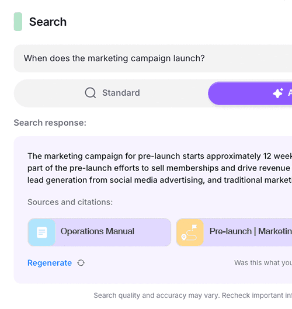

## **Introduction: A Challenge That Resonates**

Franchise management is a high-stakes game. Multiple locations, tight operational standards, and diverse teams spread across geographies—juggling all of this is no small feat. [**Delightree**](https://www.delightree.com/), founded in 2020 by Tushar Mishra and [Madhulika Mukherjee](https://www.linkedin.com/in/madhulikamukherjee/), set out to address these complexities. Their platform streamlines everyday franchise operations—automating processes, centralizing tasks, and freeing teams to focus on growth.

As the franchising world advances, though, it’s no longer enough to just digitize workflows. **AI-powered insights** and **intelligent search** have quickly become the new standard. Recognizing this shift, CTO and Co-founder **Madhulika** saw they needed to launch AI capabilities fast to stay ahead. Building it all from scratch—involving data pipelines, role-based permissions, and advanced search algorithms—would require an entirely different skill set and timeline than they had on hand.

That’s where **Unbody** came in.

## **Relatable Problem: Why Delightree Needed a Managed AI Solution**

> “Unbody is essentially the product that we wanted to build ourselves, but as a growing startup with varied priorities, we didn’t have the bandwidth. We also needed a dedicated AI team,”
>
> — Madhulika, Co-founder & CTO, Delightree

Before deciding on Unbody, Madhulika considered hiring external AI consultants. However, she realized the overhead—both in cost and time—would be substantial. They wanted an MVP to show customers quickly, but also the reassurance that their AI engine could handle the complexity of **franchise data** and permissions.

> “Originally on the market looking for a consultant… I talked to 4 consultants who advised on how to build. Then I saw Unbody and decided to opt for a managed solution.”

— Madhulika

Ultimately, **speed to market** was crucial, but so was the ability to customize AI for specific franchise roles and data access levels. That combination led them to Unbody.

## **The Implementation**

Delightree’s primary objective was to **launch AI features quickly** without draining core engineering resources. By integrating Unbody, they effectively **transformed their existing database into an AI-enabled knowledge base** with minimal coding and architectural overhead. As a result, they can now offer a range of **AI-driven capabilities**—not just as a “nice to have,” but as features their clients actively request.

> “We just wanted to launch and we wanted to launch it fast… everything that we had in our database, we wanted it to be available for AI search—complex visibility and permission-based accessibility.”
>
> — Madhulika

Thanks to Unbody’s headless architecture, Delightree was able to integrate AI capabilities without disrupting their existing tech stack. The platform's flexible API meant they could maintain their current database structure while layering on AI features. This seamless integration proved crucial for maintaining development velocity while adding sophisticated AI functionality.

## **The Features**

**AI-Powered Search & Summaries\
\
** With Unbody, Delightree’s entire database of operational materials—training, SOPs, and more—became **AI-searchable knowledge base**. Users can also generate quick summaries of long documents, cutting down on reading time.

1. **Role-Based Data Access\
   ** A cornerstone of the platform is ensuring that each franchise member only sees the data they’re authorized to view. Unbody’s advanced database query system, supports permission layers, so staff members retrieve relevant information without risking sensitive data leaks.\

2. **Minimal Learning Curve, Maximum Speed\
   ** Delightree’s team didn’t have to write new AI pipelines or code wrappers. Unbody’s out-of-the-box backend let them integrate advanced features while still focusing on their core product roadmap.\
   \

## **The Impact**

By the time the AI features went live, **customer response** was immediate. As Madhulika explains:

> “Almost 90% of customers who’ve seen it want to use it.”

While they aren’t yet charging extra for AI capabilities, the new features have acted like a magnet during demos—prompting more meetings and discussions with prospective clients. This surge in interest has helped Delightree stand out in a competitive market.

## **What’s Next**

Delightree has big plans to **expand** on their AI capabilities with Unbody:

- **AI Analytics on Dashboard Data\
  ** They already track a host of operational metrics, and they’re looking to enhance this with AI-driven insights—surfacing opportunities, gaps, and strategic recommendations.\

- **Auto-Generating Training & Audits\
  ** Currently, audits and training materials are created manually. Madhulika wants to leverage AI to significantly cut down the time it takes to develop these resources.\
  \

> “We have a lot of bars and charts… but we’d like to use Unbody/AI to show insights, opportunities, and gaps in operations. At some point, we can even generate training and audits using AI.”
>
> — Madhulika

## **The Verdict**

For Delightree, implementing Unbody was a strategic move to stay ahead of competitors without sacrificing their existing development timeline. Madhulika says she would recommend Unbody to others aiming to introduce AI quickly:

“Yes, because it reduces time to take your AI to market. The dedicated team works along with you—it feels like an off-the-shelf solution. We appreciate how you make yourselves available as founders.”

## **Ready to See What Unbody Can Do for You?**

If you’re exploring AI-driven features—and want to avoid the complexity of building everything from scratch—let’s talk. **Connect directly with our founding team** at[ https://cal.com/amir-houieh](https://cal.com/amir-houieh) and discover how we can transform your existing data into an AI-ready knowledge base.

We’re here to help you roll out powerful AI capabilities—on your timeline, and on your terms.