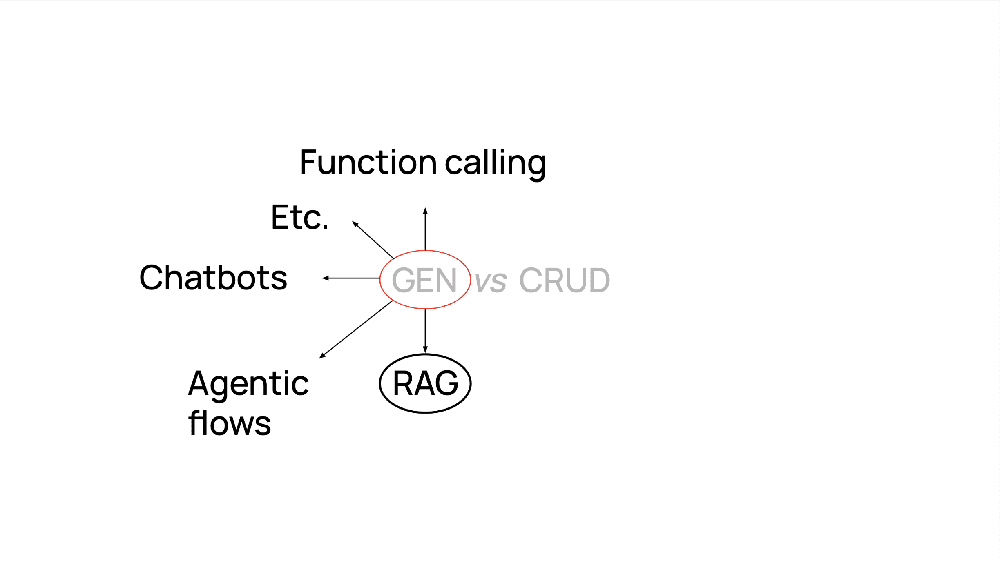
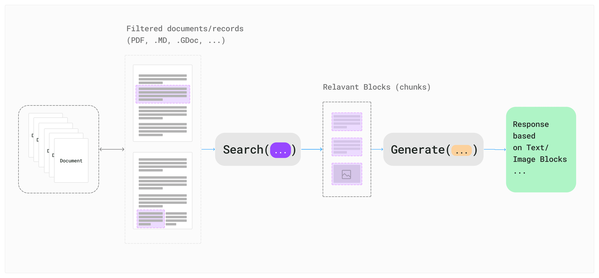
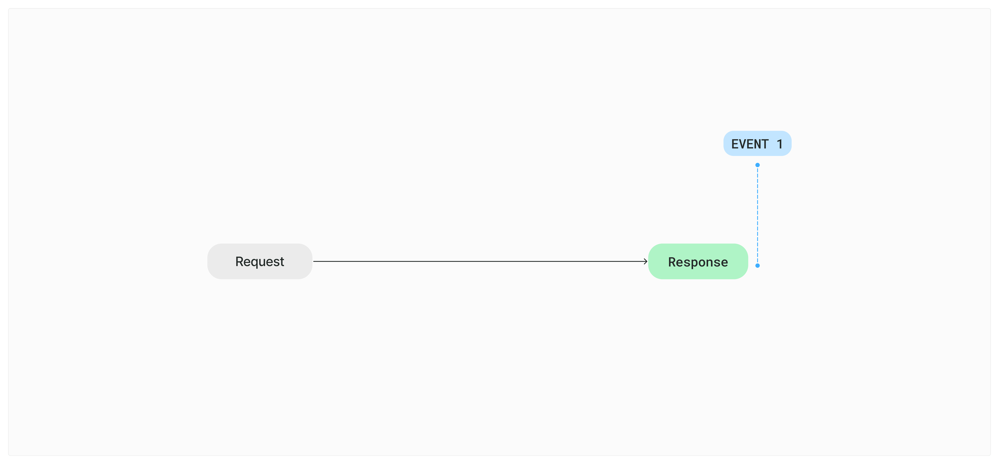
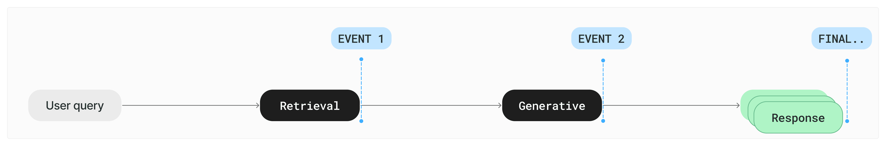
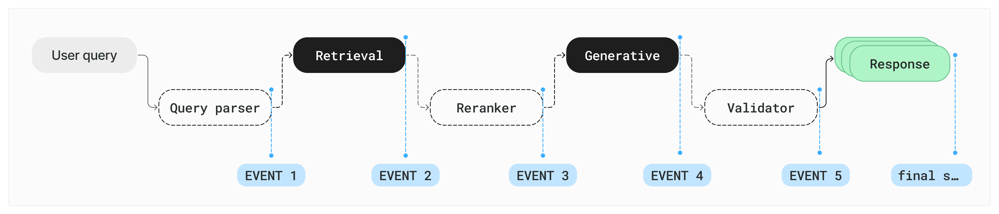
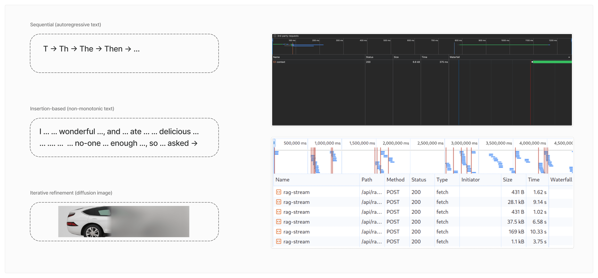
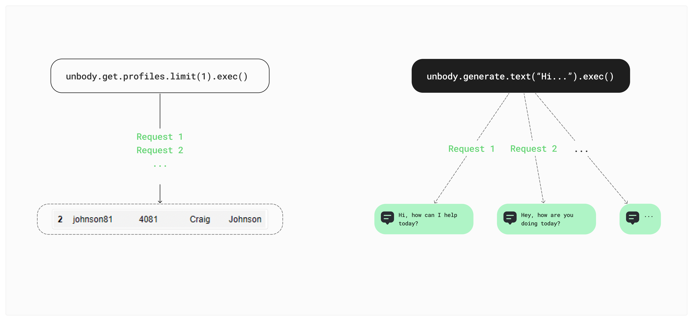
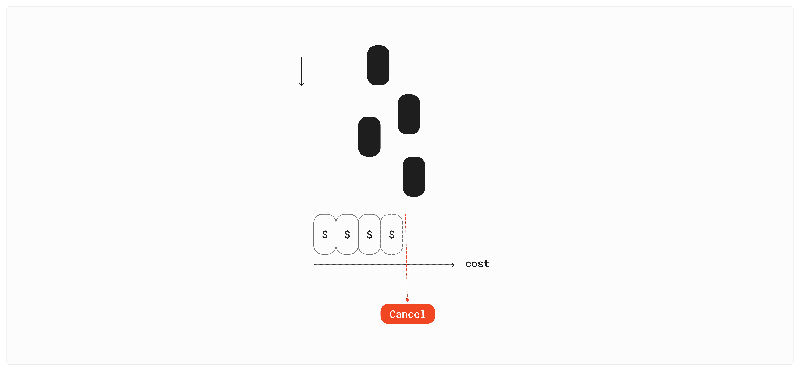
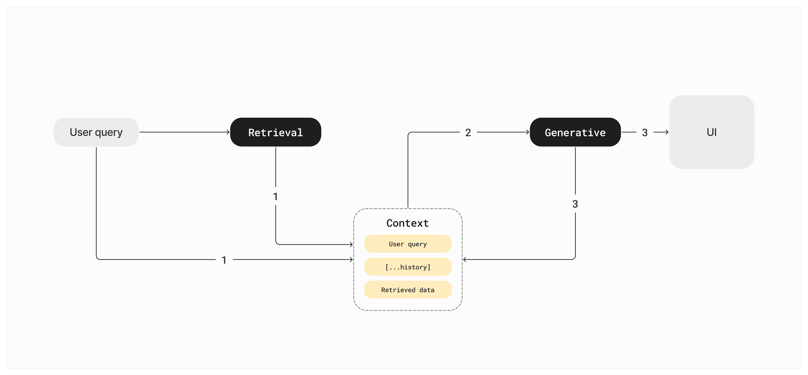
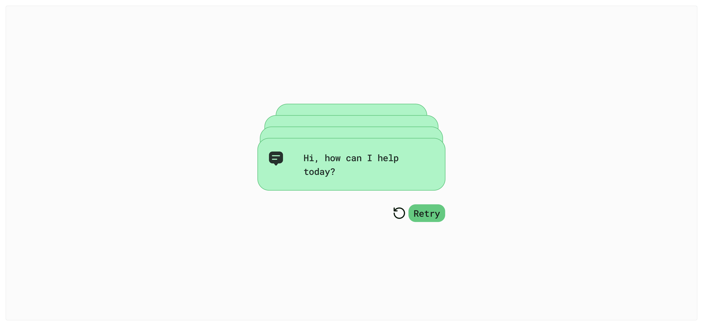

A few weeks ago, I was working on a small demo project—a basic agentic RAG layer on top of any website (here is the [Github repo](https://github.com/unbody-io/demo-web-to-chatbot)). As I was wiring up the UI, something felt off. Everything looked like a normal fetch/response flow on the surface, but the UI was behaving very differently. It wasn’t just a matter of adjusting timing or adding a loading spinner. The entire model for how state should work felt incompatible.

At first I assumed it was just one of those messy async bugs. But as I kept going—and later while talking to Unbody users—I realized the problem wasn’t the code. The problem was the **mental model**: we were still thinking like CRUD developers.

This post tries to explain what actually makes UI state management for generative flows different. No implementation details here—my CTO, [Gabor](https://x.com/krks_gbr) is planning a follow-up post for that. This is the conceptual foundation.

## Defining “gen data”

Before we talk about managing it, we need to define it.

By _generative data_, I mean any kind of output that’s not fetched from a database or static store, but is **produced**—on the fly—by a model. That includes text generation, image generation, JSON function calls, RAG responses, and more.

This can get broad quickly. To keep the discussion grounded, we’ll use **RAG** (Retrieval-Augmented Generation) as the main example. But most of the principles apply to any generative pattern.

To make this clearer, it helps to contrast it with something we do understand: the CRUD model.

## What the RAG is

RAG stands for **Retrieval-Augmented Generation**. It’s a common pattern where you combine a user’s question with relevant data from your own sources, then generate a response using that combined context.

The flow looks like this:

1. **Retrieve** relevant content from your data — could be documents, database records, webpages, etc.

2. **Generate** an answer using that retrieved content as context.

3. Return a response based on both.

This setup helps the model answer using your actual data, not just what it was trained on. You can think of it as grounding generation in real, retrievable context.

We’ll use this flow throughout the rest of the post as our working example.

## Why CRUD and GEN aren’t the same thing

Now we have all the context, let’s dive in.

In CRUD flows, you ask for a specific thing (like a row in a database), and you get it—done. The UI just needs to handle the usual request lifecycle: loading, success, maybe error. The data is a **fact**, and it’s complete when it arrives.

In generative flows, you send a query, and you get back a **generated response**—built in real time, possibly different every time, and often streamed over multiple chunks or tokens. The data is **not a fact**, it’s an interpretation. And it doesn’t always arrive in one go.

That distinction leads to three fundamental differences in how we need to think about state:

### Difference 1 — One-shot vs. multi-stage

A CRUD request is typically atomic: one request, one response.

In RAG (and most gen workflows), the process is multi-step. Even a basic pipeline has at least two stages:

And that’s just the minimal case. A more realistic setup might include:

Each of these stages can fail independently, be retried, or stream results. If your UI state model is built around a single `loading` or `error` flag, this breaks immediately.

### Difference 2 — Parcel vs. stream

In CRUD, the payload arrives all at once. In gen flows, it streams in over time—often token by token.

Sometimes this is purely sequential (e.g. autoregressive text), but other times it’s non-monotonic (e.g. insertion-based models) or even image refinement (e.g. diffusion).

But it does not really matter what type of model your are working with, If you're not thinking in terms of partial state and streaming updates, you'll either show nothing for seconds or constantly overwrite your UI.

Here’s a simplified example of how gen output is typically handled in practice:

You don’t get the data all at once. You build it as it arrives.

### Difference 3 — Facts vs. story

In CRUD flows, the data is a fact. When you fetch a row from a database, it’s precise, repeatable, and complete. It doesn’t change unless the data itself changes.

Generative responses aren’t like that. You’re not fetching a fact—you’re getting an **interpretation**, shaped by a mix of input prompt, available context, and the model’s probabilistic behavior.

Ask the same generative endpoint the same question twice, and you’ll likely get two slightly different outputs. That’s expected. Even when grounded with the same input data, the output can vary in tone, wording, or structure.

The key difference is:

> In CRUD, the response is the truth.
>
> In generative systems, the response is **a version of the truth**.

That distinction changes what you can assume about the output, how predictable it is, and how you treat it in your UI.

## What this means for UI state

Once you understand that generative data is multi-stage, streamed, and interpretative, the way you manage state has to change. Here are the key takeaways.

### 1. Handle streaming: append and cancel

Generative outputs aren’t returned all at once. For example when you use `unbody.generate.text` endpoint, you get a **readable stream** of text tokens.

So instead of setting the final result, you **append tokens** as they arrive.

At the same time, because every token costs money, and users might change their input mid-way, you also need to support **canceling** the stream immediately.

Without cancel support, you’ll burn tokens unnecessarily.

Without append logic, you can’t reflect progress in the UI.

## 2. Context is the real state you need to manage

In generative systems, the UI isn’t just showing a single API result — it’s reacting to a pipeline that spans multiple stages: retrieval, augmentation, generation, possibly reranking or validation. Each of those stages has its own state, and the composition of them is what we call **context**.

So instead of treating generation as a one-off response, you should treat the **context** as a first-class application state object — just like a Redux store or a page route.

### A sample context structure

Here’s an example of what a structured context might look like in a RAG system:

### Why persist the context?

A typical mistake is to store just the generated output, maybe log the prompt, and discard everything else. But the **retrieved records**, the **conversation history**, the **version of the model**, and the **intermediate states** — that’s what made the output possible.

If you don’t persist the context, you can’t:

- explain how a decision was made,

- rerun it later (e.g., in retry flows),

- debug inconsistencies,

- or build trust with the user.

You’re essentially throwing away the trace of your reasoning.

### This is the actual state of your generative UI

From a frontend perspective, this object — this context — is what your component should be bound to. You don’t need to persist every token, but you do need to persist **what the model saw**.

When users click “regenerate” or when you offer editing flows later, **this context is your truth**, not the model’s output.

### The context is also the UX contract

From a UI perspective, the context becomes a kind of **contract** between the system and the user:

🗣 “Given this context, this is the best interpretation we could generate.”

This makes it easier to justify or explain things if your users ask, _"Why did it say that?"_

### 3. Treat each stage as a state machine

Once you understand that generation is a pipeline — not a single shot — the next shift is in how you model state in your UI.

In CRUD apps, you often get away with a simple `isLoading` flag and a success/error condition. But in a gen flow, you’ve got multiple steps, and each of them can:

- start and finish independently,

- fail independently,

- and produce intermediate outputs.

So your app needs to treat **each stage as its own state machine**.

Here’s what that might look like in practice:

Why model it like this?

- Union types guarantee that you’re never in conflicting states (you can’t be both loading and done).

- You can give precise feedback to the user: _“Retrieving sources…”_ → _“Generating answer…”_

- You can retry only part of the flow — e.g. retry just generation if retrieval was fine.

- And your UI logic becomes much easier to manage (`switch` on state and you’re done).

### 4. Retry is expected behavior

Retries aren’t just for network failures anymore. In generative flows, **retries are a feature**.

Sometimes the model fails to produce a valid output. Sometimes you just want a second version.

And because every stage is separate, retries should also be **stage-aware**.

This keeps costs lower and UX faster.

## Wrap up

So — managing UI state for generative data is not just about handling an API call. It's about keeping track of context, understanding the shape of your pipeline, and building UI that reflects the actual stages happening behind the scenes.

None of this is theory. If you're working with RAG, calling OpenAI functions, chaining up LLM tools, or building any UI on top of generative outputs — this applies.

We didn’t get into implementation-level patterns here (hooks, stores, observers, etc.), but if you're curious about that side, let me know — we’re considering a follow-up post focused purely on the engineering mechanics.

Meanwhile, if you're building generative features and thinking hard about developer ergonomics, context structure, or anything we touched on here — I’d love to hear from you. You can try out [Unbody](https://unbody.io/) or just DM me on [X](https://www.notion.so/1dd0b5596dd88108bd78cd90dcd522a9?pvs=21), I’m always up for talking product & infra.

Thanks for reading.