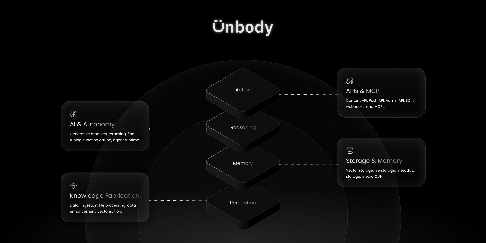

_The first modular backend for the AI-native era—built together, in the open._

### TL;DR:

- 🚀 We’ve open-sourced Unbody (alpha)

- 🧠 A data knowledge driven, AI-native backend designed to replace traditional stacks

- 🔧 Architected for modularity, autonomous agent support, and plugin extensibility

- 🤝 We’re building the Supabase of the AI era—and we're inviting you to help shape it

- ❤️ [github.com/unbody-io/unbody](http://github.com/unbody-io/unbody)

### From Cloud to Code: Why We’re Going Open

When we launched Unbody commercially last year, it was a backend-as-a-service for AI-native development—an experiment powered by curiosity, frustration, and grit. But one truth became clear:

> But one truth became clear: We weren’t going to build an excellent product without involving the wider developer community in the process.

So today, we open it up.

We're releasing Unbody as open source because we believe it's the best way to build a better product and gain developer adoption.

But there’s more to it than that.

We believe AI software should be transparent and trustworthy. As AI becomes more integrated into our daily lives, people need systems they can understand and control. Open source allows for inspection, customization, and local deployment - all critical for building trust in intelligent systems. By opening Unbody, we're taking our first step toward building AI infrastructure that prioritizes transparency and user control. We hope this approach encourages developers to build with us and helps establish stronger standards for trustworthy AI development.

### What's Inside the Alpha

This alpha release focuses on architectural flexibility rather than feature completeness. While the current implementation has limitations, we've prioritized creating a system that's easy to extend and customize: The core design emphasizes modularity, making it straightforward to adapt the system to various AI application needs even as we continue expanding the concrete set of features.

- 🧩 **Modular design:** A highly flexible system that supports both traditional plugins and autonomous AI agents that can process information and perform actions.

- 🧠 **Contextual Data Engine:** Built to transform raw, fragmented data into structured, queryable, and interconnected knowledge.

- 🔌 **Designed for integration**: The architecture supports connections to tools like [Unstructured.io](http://unstructured.io/) and LlamaIndex, with some integrations available now and others on our roadmap.

In fact, our open-source version already **outclasses our cloud service** in terms of architectural openness and modularity—even if its feature set is still growing.

Our cloud offering comes with a wealth of data integrations, built-in enhancer agents, multimodal support, and a nearly format-agnostic ingestion layer—whether your data comes as a markdown file, video, PDF, or MongoDB dump. While these are production-grade features, they come with significant trade-offs: locked-in storage, limited AI model options, and inflexible pipelines.

The open-source version gives you greater flexibility in what you integrate and how you configure the system. You can choose your own storage solutions, select which AI models to use, and customize processing pipelines to meet your specific needs.

In this transition, we’ve stayed true to Unbody’s core endpoints. Despite significant refactors in data ingestion, processing, and indexing, our content API remains unchanged, letting you interact with the knowledge base just as you always have.

> 💡Our roadmap envisions the eventual replacement of our cloud version with this open-source powerhouse.

We’re sharing Unbody OSS Alpha to open a discussion with the wider community and to make sure we’re building something that people want.

## Building the Supabase of the AI Era

The AI tooling ecosystem isn’t broken—it’s just scattered and surely complex. Building something meaningful today often means making dozens of decisions: which vector store, which LLM, which embedding model, which backend pipeline? You can stitch together a stack, but it takes time, research, and constant iteration.

What’s missing isn’t capability—it’s cohesion.

So we asked:

> **What if there were a Supabase, but for the AI era?**

Supabase radically simplified how we build modern web apps—handling databases, auth, and storage in a unified, developer-friendly stack. It gave frontend developers superpowers.

Unbody aims to bring that same spirit to AI-native software—**but for a world where software doesn’t just store and serve data... it reasons, adapts, and acts.**

**But why Another Supabase?**

To be clear: Supabase is great. It even offers AI features. But it wasn’t built for a world where your backend needs to **think**.

Supabase, Firebase and similar stacks are built around the idea of storing **static data in tables with predefined, hardcoded relationships**. That’s great for many traditional applications—but AI-native products demand a different approach.

Why? Because the way we interact with software has fundamentally changed.

We no longer just click buttons or fill forms. Today, we **talk** to software. We ask it questions. We expect it to reason, summarize, and even take action on our behalf.

That’s a huge shift.

Legacy software was passive. AI-native software is **active**, **context-aware**, and increasingly **autonomous**. And to support that, the backend has to evolve from storing static data to managing dynamic, enriched knowledge.

Here’s where traditional stacks fall short:

1. **Intelligence, Not Just Data**

   AI-native software needs more than rows in tables. It needs _knowledge_—data that’s enriched, connected, and semantically aware. It’s the difference between storing facts and enabling reasoning.

2. **Dynamic Knowledge, Not Static Tables**

   To mimic human intelligence, software needs a dynamic, evolving graph of meaning—not a rigid schema with hardcoded joins. Traditional databases don’t offer that. Even vector databases, on their own, stop at representation. You still need context, enrichment, memory.

3. **Built-In AI Essentials**

   Things like data ingestion, enhancement, chunking, vectorization, reranking, and summarization—these aren’t “extras” in AI-native apps. They’re essential infrastructure. Yet in most stacks (e.g; MERN, MEAN, etc…), you're left to duct-tape them together.

4. **Multimodality by Default**

   Human knowledge isn’t just text. It’s visual, audible, sensory. If you’re building software that _understands like a human_—not just stores data—you need a backend that can ingest and process images, video, audio, and more. Anything less is incomplete.

So no—Unbody isn’t “just another RAG builder.”

It’s a **Supabase-style stack** for building AI-native products from the ground up.

Without Unbody, even building a _simple_ Q\&A bot requires:

- Spinning up a vector database (Weaviate, Pinecone, etc.)

- Choosing and integrating a text embedding model

- Creating a pipeline for chunking and ingesting content

- Manually wiring retrieval logic

- Calling an LLM for generation

- Stitching all this into your backend—and maintaining it

With Unbody, that becomes a config file.

And more importantly, you're not locked into our defaults—you can bring your own vector store, embedding model, parser, or AI provider. It’s built for **opinionated flexibility**: you get batteries included, but nothing is hardcoded.

## The Modular Stack

Please see the README.md on our [Github repo](https://unbody.io/github.com/unbody-io/unbody) for more in-depth information and a complete list of modules and plugins.

If software is becoming more like humans—able to think, speak, and act—then the backend that powers it needs to work like a brain.

That’s why Unbody is built on **four functional layers** that mirror how intelligent systems (or humans) operate:

- **Perception** (Knowledge Fabrication): how it sees and understands the world

- **Memory** (Storage and Persistant Memory): what it knows and remembers

- **Reasoning** (AI & Autonomy): how it thinks, decides, and plans

- **Action** (APIs & MCP): how it interacts with others and takes initiative

### Perception (Knowledge Fabrication)

_Where raw data becomes structured, enriched knowledge._

- **Data Ingestion** — Connect and pull content from third-party platforms, local files, websites, databases, or inject your own data directly.

- **Processing** — Automatically parse and structure raw multi-modal data from Google Docs, and markdown, to PDFs, to videos and audio.

- **Enhancement** — Enhance, augment and transformed raw data for more semantic and contextual knowledge-base using pluggable enhancer agents and plugins (e.g. OCR, summarizers, extractors, web crawler, Geo location mapping, etc).

- **Vectorization** — Generate semantic vector representations using OpenAI, Cohere, Transformers, or your own models.

### Persistence Memory (Storage & Vector Stores)

_Where your enriched knowledge lives—ready to be retrieved and reasoned over._

- **Vector Storage** — Store embeddings in vector databases like Weaviate, Pinecone, or Qdrant.

- **File Storage** — Persist raw and processed files using local storage, S3, or GCS.

- **Media Serving** — Access and serve media through Unbody’s CDN and signed URLs.

- **Metadata Store** — Keep track of content structure, relationships, and context.

### Reasoning (AI & reasoning)

_Where intelligence happens—generation, decision-making, and function execution._

**Generative Modules**

- **Text Generation** — Built-in support for GPT-4, Claude, Mistral, and more. Use hosted APIs or self-hosted models.

- **JSON Generation** — Produce structured responses, function outputs, and machine-readable payloads.

- **Image Generation** — (Roadmap) Cloud-only support for visual generation.

**Function Calling**

- **Function Registry** — Define callable functions for your agents and APIs via schema-based definitions.

- **Execution & Routing** — Dynamically execute internal or external functions with intent parsing, argument validation, and dispatching.

### Action (APIs & MCP)

_Where your backend connects to the outside world—via APIs, SDKs, and events._

- **Content API** — Query your knowledge-base via GraphQL. Supports filtering, semantic queries, and structured retrieval.

- **Push API** — Push structured data directly into Unbody.

- **Admin API** — Configure schemas, projects, pipelines, and permissions.

- **MCP (Middleware Control Plane)** — Connect Unbody to external systems, events, and workflows.

- **SDKs** — Available in TypeScript, iOS, Android.

## What’s Next

Now that we’re open, here’s our roadmap:

- Richer OSS plugin and agent ecosystem

- Function calling layer

- Chat endpoints with memory and long-term context

- Support for authentication systems

- Integration with observability monitoring systems

**But for now, we’re in feedback mode. We want to know what works, what breaks, and what you’d like to see improved.**

### We Need Your Feedback

We are releasing the alpha because we wanted to build with the community feedback. To do so we would love to invite you to please give Unbody Alpha a try and boombar us with your feedbacks and thoughts.

→ \[🛠 [GitHub Repo](https://github.com/unbody-io/unbody)]

→ \[💬 [Discord](https://discord.gg/UX8WKEsVPu)]

→ hello \[@] [unbody.io](http://unbody.io/)