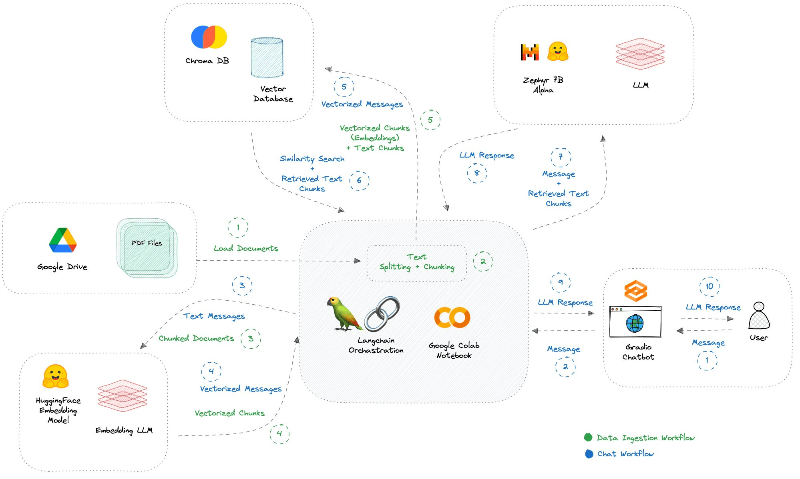
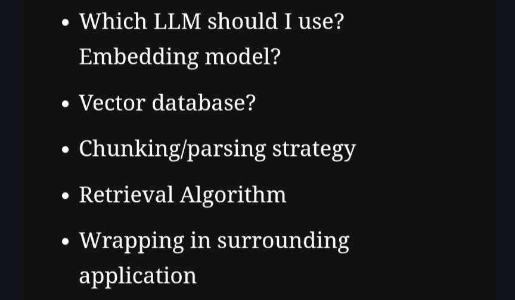

As we navigate through the evolving landscape of AI applications, we've unpacked the challenges around personalization and the intricacies of managing scattered data. Yet, a deeper dive into AI development reveals a complex ecosystem that not only developers grapple with but also poses significant strategic considerations for business owners.

## The Developer's Puzzle and the Business Quandary

_A regular tech stack for a simple chatbot - from _[_@aigeek\_\_(opens in a new tab)_](https://x.com/aigeek__/status/1717046220714308026) Imagine embarking on a project to create a chatbot, tapping into data from Google Drive and Slack. The toolset quickly expands, encompassing LangChain, vector databases like LlamaIndex, RAG APIs, and various vectorizers. For developers, it's akin to navigating a maze of query languages and document parsers. For business owners, this complexity translates into a stark reality: **the need to assemble a team of specialized AI engineers, escalating costs, and extending timelines before a single line of code is written.**

Jery Liu, CEO of LlamaIndex, underscores this challenge: "Building LLM apps comes laden with decisions that can daunt even seasoned developers." This complexity isn't merely a technical hurdle; it's a strategic bottleneck that can derail innovation and exhaust resources.

_The decisions you have to make when it comes to building LLM app - _[_Jery liu - CEO of LlamaIndex_](https://blog.llamaindex.ai/introducing-llama-packs-e14f453b913a)

## The Cascade of Challenges

The technological symphony required to develop, deploy, and maintain AI applications often plays out of tune, with each component adding layers of complexity. This not only tests the resolve of developers but also forces business owners to navigate a precarious balance between innovation and operational feasibility.

Deployment and maintenance emerge as Herculean tasks, demanding ongoing attention and resources. This reality can be disheartening, making AI seem like an elusive goal, accessible only to those with deep pockets and extensive technical teams.

### Bridging the Gap

To demystify the terrain, let's clarify some key terms that often populate discussions around AI development:

- **Large Language Models (LLM)**: The powerhouse of understanding and generating human-like text.

- **Retrieval-Augmented Generation (RAG)**: An AI's research assistant, pulling in information to enhance responses.

- **Machine Learning (ML)**: The process enabling computers to learn and make decisions from data.

- **Vectorizing and Embeddings**: Translating diverse data into a language AI understands.

- **Multimodal**: AI's ability to process various data types, like text and images, simultaneously.

- **Vector Database**: A specialized database catering to AI's need for storing complex, multi-dimensional data.

## Unbody's Simplified Solution

Amid these challenges, Unbody emerges as a pivotal solution, streamlining the path from concept to deployment. Our platform is a beacon for both developers and business owners, transforming the AI development maze into a straightforward path.

Unbody automates the intricate processes of data cleaning, preparation, and integration, reducing the need for specialized AI personnel and cutting down on development time and costs. For business owners, this means **lower overheads and a faster time-to-market**—crucial advantages in today's competitive landscape.

From development through deployment and maintenance, Unbody encapsulates the entire lifecycle, making AI not just a technical possibility but a strategic asset. We empower businesses to harness the power of AI, regardless of their technical expertise, turning ambitious visions into tangible solutions.

## Conclusion

The journey to unlocking AI's potential is fraught with challenges, but it's far from insurmountable. With Unbody, the complexities of AI development, deployment, and maintenance become manageable, allowing businesses to focus on innovation and growth.

Don't hesitate to reach out — our experts are more than happy to discuss how Unbody can bring your AI aspirations to life with a simple conversation. Let's get on a call and start crafting your AI story.