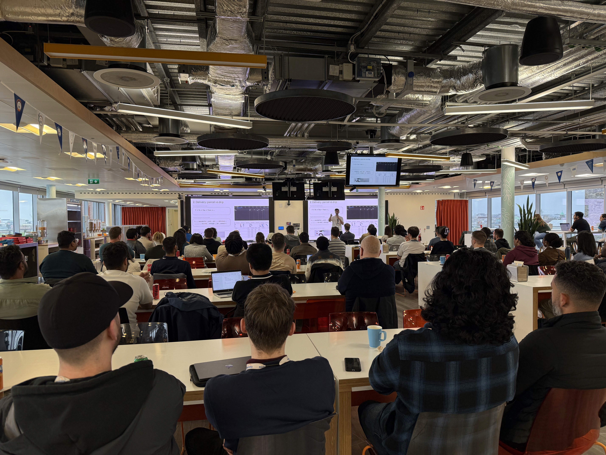

We're starting a new habit: short weekly posts on what’s been shipped, changed, or explored at Unbody. Here’s what happened last week.\

### Talk at React Dublin

Amir gave a talk on UI state management for generative apps — a topic that's becoming increasingly relevant as AI-generated content replaces static responses.\
The talk covered strategies for handling **multi-stage**, **streamed**, and **interpretative outputs**, contrasting them with conventional CRUD models.\
Key ideas included:

- Treating each generation stage as a state machine

- Managing context as first-class application state

- Streaming token-level updates

- Building retries and rollbacks as core features, not afterthoughts

📖 Full write-up here:  [unbody.io/blog/gen-data-ui-state](https://unbody.io/blog/gen-data-ui-state)\

### TypeScript SDK v0.0.15

We released `unbody-sdk` v0.0.15.\
The main change: support for **streaming responses** from the `generate()` endpoint.\
Docs and usage examples here: [docs.unbody.io/generative-and-rag/streaming](https://docs.unbody.io/generative-and-rag/streaming)\

### Open Source

A few updates on the [OSS repo](https://github.com/unbody-io/unbody):

- [#21](https://github.com/unbody-io/unbody/pull/21): Plugin configuration is now validated before init. Also improved fatal error handling during plugin registration.

- Enabled stricter TypeScript compiler settings for better safety and consistency.